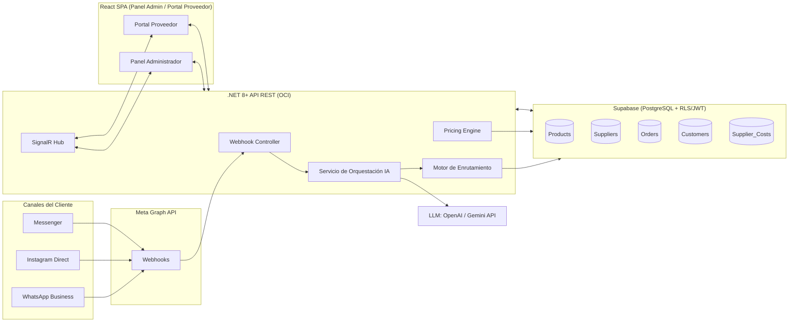
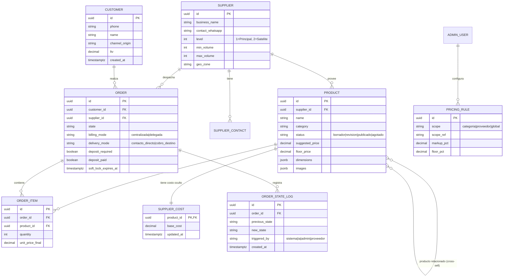
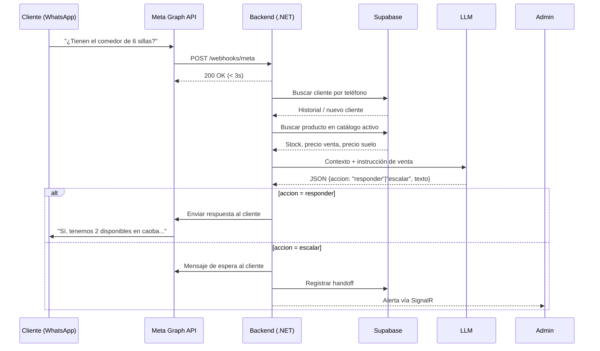
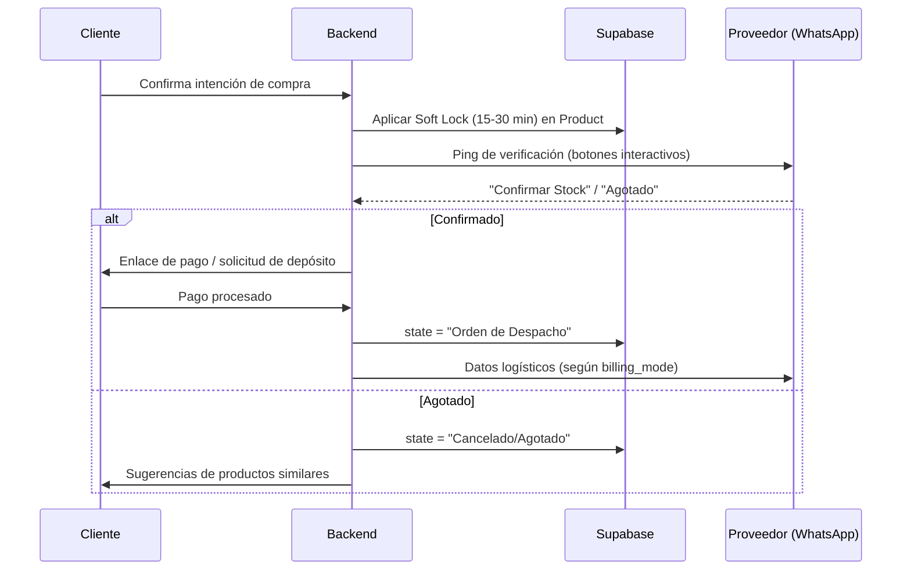

# Documento de Diseño Técnico
### Hub de Retail "Just-in-Time" y CRM Omnicanal para Venta de Mobiliario
**Versión 1.0 — Complementa el Documento de Especificación de Requerimientos (ERS)**

---

## 1. Arquitectura General



**Notas de arquitectura:**
- El backend es el único componente con permisos de escritura sensibles; el frontend consume exclusivamente la API REST y el canal SignalR.
- Supabase actúa como fuente de verdad y como capa de autorización (RLS), reduciendo lógica de permisos duplicada en el backend.
- El LLM nunca accede directamente a la base de datos: siempre recibe contexto ya consultado y filtrado por el backend (evita fugas de `Supplier_Costs`).

---

## 2. Modelo de Datos

### 2.1 Diagrama Entidad-Relación



### 2.2 Notas sobre seguridad a nivel de fila (RLS)

| Tabla | Regla RLS (resumen) |
|---|---|
| `products` | Lectura pública solo si `status = 'publicado'`. Escritura restringida al rol `admin`. |
| `supplier_cost` | Sin acceso para roles `supplier` y `customer`. Solo `admin`. |
| `orders` | Rol `supplier` solo lee filas donde `supplier_id = auth.uid()` mapeado. Rol `admin` ve todo. |
| `order_state_log` | Igual que `orders`; heredado por `order_id`. |
| `customers` | Visible solo para `admin`; `supplier` nunca ve datos de contacto del cliente salvo que la orden esté en modalidad "Contacto Directo" (se libera vía función segura, no acceso directo a la tabla). |

Ejemplo de política (pseudo-SQL, Supabase):

```sql
create policy "supplier_reads_own_orders"
on orders for select
using ( supplier_id = (auth.jwt() ->> 'supplier_id')::uuid );

create policy "only_admin_reads_costs"
on supplier_cost for select
using ( (auth.jwt() ->> 'role') = 'admin' );
```

---

## 3. Especificación de Endpoints API (REST — .NET 8)

Prefijo base: `/api/v1`

### 3.1 Catálogo

| Método | Endpoint | Descripción | Rol requerido |
|---|---|---|---|
| GET | `/products` | Lista productos publicados (filtros: categoría, proveedor). | Público |
| GET | `/products/{id}` | Detalle de un producto. | Público |
| POST | `/products/draft` | Crea un pre-producto en estado `borrador` (usado por ingesta WhatsApp o portal proveedor). | Sistema / Proveedor |
| PATCH | `/products/{id}` | Edita datos del borrador (precio, dimensiones, categoría). | Admin |
| POST | `/products/{id}/process-image` | Remueve fondo / recorta / aplica marca de agua. | Admin |
| POST | `/products/{id}/publish` | Publica el producto (valida checklist RF-05). | Admin |
| PATCH | `/products/{id}/status` | Marca producto como `agotado`. | Admin / Proveedor (solo propios) |

### 3.2 Precios

| Método | Endpoint | Descripción | Rol requerido |
|---|---|---|---|
| POST | `/pricing/calculate` | Dado `base_cost` + regla aplicable, retorna `suggested_price` y `floor_price`. | Admin |
| GET | `/pricing/rules` | Lista reglas de margen configuradas. | Admin |
| POST | `/pricing/rules` | Crea/edita regla de margen (por categoría/proveedor/global). | Admin |

### 3.3 Proveedores

| Método | Endpoint | Descripción | Rol requerido |
|---|---|---|---|
| GET | `/suppliers` | Lista proveedores con nivel y capacidad. | Admin |
| POST | `/suppliers` | Registra un nuevo proveedor y su contacto WhatsApp. | Admin |
| GET | `/suppliers/{id}/orders` | Órdenes delegadas al proveedor (filtradas por RLS). | Proveedor / Admin |
| GET | `/suppliers/{id}/settlements` | Historial de conciliaciones/liquidaciones. | Proveedor / Admin |

### 3.4 Órdenes

| Método | Endpoint | Descripción | Rol requerido |
|---|---|---|---|
| POST | `/orders` | Crea una orden en estado `Consulta` o `Intención de Compra`. | Sistema (IA) / Admin |
| GET | `/orders/{id}` | Detalle de la orden y su historial de estados. | Admin / Proveedor (propia) |
| PATCH | `/orders/{id}/state` | Transiciona el estado (ver máquina de estados, ERS §5). | Sistema / Admin |
| POST | `/orders/{id}/verify-stock` | Dispara el "ping" de verificación al WhatsApp del proveedor. | Sistema |
| POST | `/orders/{id}/confirm-stock` | Callback del botón interactivo de Meta ("Confirmar" / "Agotado"). | Webhook Meta |
| POST | `/orders/{id}/deposit` | Registra pago de depósito de seguridad. | Sistema (gateway) |
| PATCH | `/orders/{id}/billing-mode` | Alterna facturación centralizada/delegada. | Admin |
| POST | `/orders/{id}/reconcile` | Cierra la conciliación proveedor-admin. | Admin |

### 3.5 CRM / Chats

| Método | Endpoint | Descripción | Rol requerido |
|---|---|---|---|
| GET | `/conversations` | Bandeja unificada (WhatsApp, IG, Messenger). | Admin |
| GET | `/conversations/{id}/messages` | Historial del hilo. | Admin |
| POST | `/conversations/{id}/handoff` | Fuerza el paso de IA a humano. | Admin / Sistema |
| POST | `/conversations/{id}/quote` | Genera cotización (enlace de pago / PDF). | Admin |

### 3.6 Webhooks (Meta)

| Método | Endpoint | Descripción |
|---|---|---|
| GET | `/webhooks/meta` | Verificación inicial (`hub.challenge`). |
| POST | `/webhooks/meta` | Recepción de mensajes/eventos en tiempo real. Debe responder `200 OK` en &lt;3s (RNF-03). |

### 3.7 Analítica

| Método | Endpoint | Descripción | Rol requerido |
|---|---|---|---|
| GET | `/analytics/kpis` | Margen por proveedor, stockout rate, conversión, ticket promedio. | Admin |
| GET | `/analytics/cohorts` | Análisis de recompra por cohortes. | Admin |

---

## 4. Diagramas de Secuencia

### 4.1 Flujo del Agente de IA ante una consulta de cliente



### 4.2 Flujo de validación de stock y checkout



---

## 5. Consideraciones de Despliegue

- **Backend:** VM en Oracle Cloud Infrastructure (OCI), puerto expuesto para webhooks de Meta con certificado TLS válido (requisito de Meta Graph API).
- **Base de datos:** Instancia gestionada de Supabase; habilitar backups automáticos y `point-in-time recovery`.
- **Frontend:** Build estático de React servido vía CDN o el mismo OCI; conexión a Supabase Realtime / SignalR para actualizaciones en vivo.
- **Secretos:** Tokens de verificación de Meta, claves de LLM y credenciales de Supabase gestionados vía variables de entorno / vault, nunca en el repositorio.
- **Observabilidad mínima recomendada:** logging estructurado de cada transición de estado de orden y de cada decisión del agente IA (trazabilidad, RNF-05).
